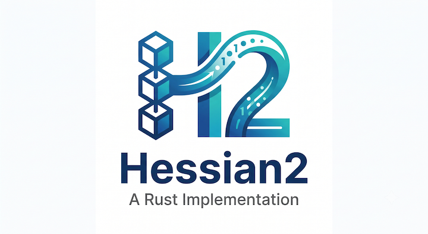

# Hessian2


[](https://app.codecov.io/gh/jjeffcaii/hessian2o3)
[](https://crates.io/crates/hessian2)
[](https://crates.io/crates/hessian2)


A Rust implementation of the [Hessian 2.0 Serialization Protocol](http://hessian.caucho.com/doc/hessian-serialization.html), commonly used for Java/Dubbo RPC interop.

> **:warning: This project is a work in progress and not ready for production use.**

## Features

- **Encoding & decoding** — full Hessian 2.0 binary serialization, including compact int/long/double forms, chunked strings/binary, typed lists/maps, and class-definition reuse for objects; decoding accepts every list form (direct, fixed-length, and `'Z'`-terminated variable-length)
- **serde integration** — encode/decode any `Serialize` / `Deserialize` type via `to_vec` / `to_writer` / `from_slice` / `from_reader`; wrap a value as `Hessian(&value)` to make `to_vec`/`to_writer` prefer its manual `HSerialize` impl over `Serialize` when a type implements both
- **`#[derive(HessianSerialize)]`** — map Rust structs to Java classes with `#[hessian(class = "...")]` and per-field `#[hessian(rename = "...")]`, generating both `HSerialize` and `HDeserialize` impls
- **Dynamic `Value` type** — decode arbitrary Hessian data without knowing its shape upfront, with indexing and `Display` support
- **`hessian!` macro** — build a `Value` from a JSON-like literal, similar to `serde_json::json!`
- **`hessian2::prelude`** — `use hessian2::prelude::*;` pulls in the common traits and derive macro (`HSerialize`, `HDeserialize`, `HessianSerialize`, `Hessian`, `HessianWriteable`) in one line
- **Hessian `Date` support** — `#[serde(with = "hessian2::date")]` on an `i64` (Unix milliseconds) field encodes/decodes it as a native Hessian date instead of a plain long

## Installation

```toml
[dependencies]
hessian2 = "0.0.7"
```

## Usage

### serde round trip

Any type implementing `serde::Serialize` / `serde::Deserialize` works out of the box:

```rust
use hessian2::{from_slice, to_vec};
use serde::{Deserialize, Serialize};

#[derive(Serialize, Deserialize, Debug, PartialEq)]
struct Point {
    x: i32,
    y: i32,
}

let point = Point { x: 1, y: 2 };
let bytes = to_vec(&point)?;
let back: Point = from_slice(&bytes)?;
assert_eq!(point, back);
```

`to_writer` and `from_reader` are also available for streaming to/from `io::Write` / `io::Read`.

If a type implements both `Serialize` and `HSerialize` (see below), `to_vec`/`to_writer` default to the `Serialize` path; wrap it in `Hessian(&value)` to force the `HSerialize` path instead:

```rust
use hessian2::{Hessian, to_vec};

let bytes = to_vec(&Hessian(&point))?;
```

### Hessian `Date` fields

`serde::Serializer`/`Deserializer` have no dedicated hook for Hessian's `Date` wire type, so a plain `i64` field is encoded as a `long` by default. Opt an `i64` (Unix milliseconds) field into the native `Date` encoding (tag `0x4a`/`0x4b`) with `#[serde(with = "hessian2::date")]`:

```rust
use hessian2::{from_slice, to_vec};
use serde::{Deserialize, Serialize};

#[derive(Serialize, Deserialize, Debug, PartialEq)]
struct Employee {
    name: String,
    #[serde(with = "hessian2::date")]
    created_at: i64,
}

let employee = Employee {
    name: "Alice".to_owned(),
    created_at: 1_749_540_617_123,
};
let bytes = to_vec(&employee)?;
let back: Employee = from_slice(&bytes)?;
assert_eq!(employee, back);
```

Decoding accepts either wire flavor (`Date` or a plain `long`) for such a field. This also applies to the dynamic `Value` type: `PrimitiveValue::Date` round-trips through `to_vec`/`from_slice` as a native Hessian date.

### Java objects with `#[derive(HessianSerialize)]`

To interop with Java, encode a struct as a Hessian *object* carrying a Java class name. `#[derive(HessianSerialize)]` generates both `HSerialize` and `HDeserialize` impls:

```rust
use hessian2::HessianSerialize;
use hessian2::hessian::{hessian_from_slice, hessian_to_vec};

#[derive(HessianSerialize, Debug, PartialEq)]
#[hessian(class = "com.example.Point")]
struct Point {
    x: i32,
    #[hessian(rename = "yCoord")]
    y: i32,
}

let point = Point { x: 1, y: 2 };
let bytes = hessian_to_vec(&point)?;
let back: Point = hessian_from_slice(&bytes)?;
assert_eq!(point, back);
```

Nested `#[derive(HessianSerialize)]` structs are supported, and repeated classes reuse Hessian class-definition references automatically.

### Building a `Value` with the `hessian!` macro

```rust
use hessian2::hessian;

// map
let user = hessian!({
    "id": 123,
    "name": "Jerry",
    "age": 18,
});

// a "$class" entry turns the literal into a Value::Object instead of a Value::Map
let user_obj = hessian!({
    "$class": "com.example.User",
    "id": 123,
    "name": "Jerry",
    "age": 18,
});

// lists, nesting, scalars, null, and variables all work too
let age = 18;
let list = hessian!([1, "two", [3, 4], null, age]);
```

### Decoding unknown data into `Value`

When you don't know the shape of the incoming bytes, decode into the dynamic `Value` type:

```rust
use hessian2::from_slice;
use hessian2::value::Value;

let data: &[u8] = &[ /* hessian bytes */ ];
let value: Value = from_slice(data)?;

// index into maps and lists
println!("{}", value["name"]);
println!("{}", value[0]);
```

## The `Value` type

`Value` is an enum covering every Hessian type:

```rust
pub enum Value {
    Null,
    Primitive(PrimitiveValue),  // bool, int, long, double, date, binary, string
    List(List),
    Map(Map),
    Object(Object),             // Java object with class name and named fields
    Ref(usize),                 // back-reference to a previously decoded value
}
```

It supports `Display`, `Debug`, `PartialEq`, and indexing by integer (lists) or string key (maps). Use `hessian2::value::to_value` / `from_value` to convert between `Value` and any serde-compatible type.

## Type mapping

| Rust type | Hessian type |
|---|---|
| `bool` | boolean |
| `i8` / `i16` / `i32` / `u8` / `u16` | int (compact) |
| `i64` / `u32` / `u64` | long (compact) |
| `f32` / `f64` | double (compact) |
| `String` / `&str` | string (chunked UTF-8) |
| `Vec<u8>` (via `serialize_bytes`) | binary (chunked) |
| `Option<T>` | null or T |
| `Vec<T>` | untyped fixed list |
| `HashMap<K, V>` | untyped map |
| `i64` with `#[serde(with = "hessian2::date")]` | date |
| structs via `#[derive(HessianSerialize)]` | Java object |

## Examples

Runnable examples live in [`examples/`](examples/):

```bash
cargo run --example hessian_macro    # hessian! literals
cargo run --example hessian_object   # #[derive(HessianSerialize)] round trips
```

## Development

```bash
cargo build
cargo test
cargo clippy
cargo fmt
```

## License

[MIT](LICENSE)
